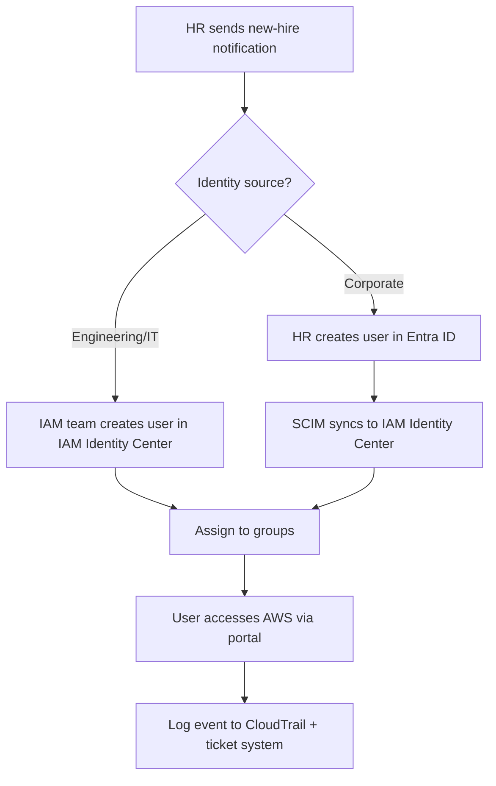
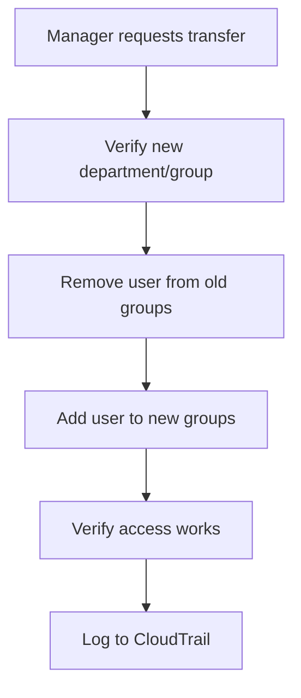
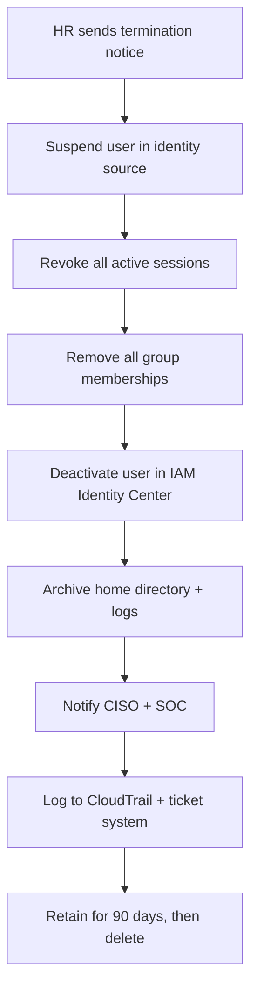

# Scenario 1: User Lifecycle — Design

## Architecture Overview

InnoGrid's user lifecycle follows a **source-of-truth** model where the identity source determines the provisioning path:

```
┌──────────────────────────────────────────────────────────────────┐
│                        HR System (Workday)                       │
│              ┌─────────────┴─────────────┐                      │
│              │                           │                      │
│              ▼                           ▼                      │
│   ┌──────────────────┐       ┌────────────────────┐            │
│   │  Entra ID        │       │  HR Notification    │            │
│   │  (Corporate):    │       │  (email/ticket)     │            │
│   │  HR, Finance,    │       │  Engineering/IT     │            │
│   │  Legal, Exec     │       │  users              │            │
│   └────────┬─────────┘       └──────────┬─────────┘            │
│            │ SCIM Sync                  │ Manual or            │
│            ▼                            ▼ scripted             │
│   ┌──────────────────────────────────────────────┐             │
│   │         AWS IAM Identity Center              │             │
│   │   (Single pane of glass for AWS access)      │             │
│   │                                              │             │
│   │  Users ←→ Groups ←→ Permission Sets ←→ AWS  │             │
│   │              Accounts                        │             │
│   └──────────────────────┬───────────────────────┘             │
│                          │                                      │
│                          ▼                                      │
│   ┌──────────────────────────────────────────────┐             │
│   │         AWS Account: inno-nonprod            │             │
│   │   Permission set: DevAccess                  │             │
│   └──────────────────────────────────────────────┘             │
└──────────────────────────────────────────────────────────────────┘
```

## Identity Source Decision Tree

```
Is the user in Engineering or IT?
  ├── YES → Managed directly in AWS IAM Identity Center
  │         (IAM team creates/manages user via Terraform or console)
  │
  └── NO  → Managed in Entra ID
            (IAM team triggers HR to create user in Entra ID;
             SCIM syncs to IAM Identity Center automatically)
```

## Joiner Process



### Group Design for Engineering Users

| Group Name | IAM Identity Center Group | Permission Set | Target Account |
|---|---|---|---|
| `engineering` | All Engineers | `DevAccess` | Nonproduction |
| `platform-engineers` | Platform team | `DevAccess` | Nonproduction |
| `app-dev` | Application Developers | `DevAccess` | Nonproduction |
| `qa-engineers` | QA team | `DevAccess` | Nonproduction |

Daniel Park will be assigned to `engineering` and `platform-engineers`.

### Permission Set: DevAccess

```
DevAccess (inno-nonprod):
  - AWSManagedPolicy: ReadOnlyAccess
  - Inline policy: s3:ListBucket, s3:GetObject (dev-artifacts bucket only)
  - Session duration: 8 hours
  - Relay state: https://console.aws.amazon.com/ec2
```

## Mover Process



Key principle: **Remove old group first, then add new group** to ensure the user doesn't retain unintended access. If overlapping access is acceptable (same account, same permission set), the order doesn't affect functionality — but from a security standpoint, the old group should be removed promptly.

For Maya Johnson:
1. Remove from `app-dev` group
2. Add to `platform-engineers` group
3. Update manager attribute from Derek Jones to Priya Sharma

## Leaver Process



### Leaver Steps (detailed)

1. **Suspend** — Disable the user in the identity source (IAM Identity Center or Entra ID)
2. **Revoke sessions** — Clear active IAM Identity Center sessions so the user is logged out immediately
3. **Remove groups** — Strip all group memberships so no AWS accounts are accessible
4. **Deactivate** — Set the user status to `DISABLED` in IAM Identity Center
5. **Archive** — Preserve CloudTrail logs, IAM Identity Center events, and any S3 home directory for 90 days
6. **Notify** — Send confirmation to CISO (Sarah Chen) and SOC (Tanya Brooks)
7. **Purge** — After 90-day retention, delete the user permanently

## Audit Trail

Every lifecycle operation must record:

| Field | Example |
|---|---|
| **Event type** | `JOINER`, `MOVER`, `LEAVER` |
| **User** | `daniel.park@innogrid.com` |
| **HR ticket** | `HR-2026-071` |
| **IAM ticket** | `IAM-2026-042` |
| **Performed by** | `aisha.patel@innogrid.com` |
| **Timestamp** | `2026-06-26T09:15:00Z` |
| **Change detail** | `Created user + assigned engineering,platform-engineers groups` |

These are captured in CloudTrail (for IAM Identity Center API calls) and in a local audit log for HR reference.

## Compliance Mapping

| Requirement | Control | How It's Met |
|---|---|---|
| SOC 2 CC6.1 | Logical access | Identity source → IAM Identity Center → groups → permission sets |
| SOC 2 CC6.2 | Timely deprovisioning | Leaver process: suspend within 1 hour, deactivate within 24 hours |
| SOC 2 CC6.3 | Access reviews | Group membership changes logged and reviewed monthly |
| ISO 27001 A.9.2.1 | User registration & de-registration | Documented joiner/leaver workflow with audit trail |
| ISO 27001 A.9.2.5 | Review of user access rights | Mover process updates groups immediately on role change |
