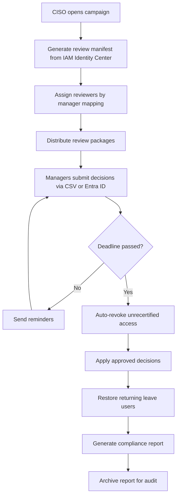

# Scenario 2: Access Certification — Design

## Architecture Overview

InnoGrid uses a hybrid access certification model:

- **IAM Identity Center-managed users** (Engineering & IT) — reviewed via a custom Python script that generates a review manifest and processes manager decisions from a CSV file
- **Entra ID-synced users** (Corporate) — reviewed using **Entra ID Access Reviews** (native capability), with results exported for the unified compliance report

```
┌──────────────────────────────────────────────────────────────────┐
│                     Q3 2026 Access Review Campaign               │
│                                                                  │
│   ┌─────────────────────────┐    ┌──────────────────────────┐   │
│   │  IAM Identity Center    │    │  Entra ID Access Reviews │   │
│   │  (Engineering & IT)     │    │  (Corporate users)       │   │
│   │                         │    │                          │   │
│   │  Generate review CSV ───┼───►│                          │   │
│   │  Process decisions      │    │  Native review workflow  │   │
│   │  Apply changes via API  │    │  Export results          │   │
│   └─────────────┬───────────┘    └────────────┬─────────────┘   │
│                 │                              │                 │
│                 └──────────┬───────────────────┘                 │
│                            ▼                                     │
│               ┌─────────────────────────┐                       │
│               │  Unified Compliance     │                       │
│               │  Report (SOC 2 / 27001) │                       │
│               └─────────────────────────┘                       │
└──────────────────────────────────────────────────────────────────┘
```

## Review Campaign Lifecycle



## Data Model

### Review Manifest (CSV)

```csv
user_email,user_name,department,manager_email,manager_name,group,permission_set,account_id,account_name,decision,notes
alex.rivera@innogrid.com,Alex Rivera,Engineering,priya.sharma@innogrid.com,Priya Sharma,platform-engineers,DevAccess,123456789012,inno-nonprod,APPROVE,
sam.green@innogrid.com,Sam Green,Engineering,priya.sharma@innogrid.com,Priya Sharma,platform-engineers,DevAccess,123456789012,inno-nonprod,APPROVE,
daniel.park@innogrid.com,Daniel Park,Engineering,priya.sharma@innogrid.com,Priya Sharma,platform-engineers,DevAccess,123456789012,inno-nonprod,APPROVE,
miguel.torres@innogrid.com,Miguel Torres,IT & Security,ryan.mitchell@innogrid.com,Ryan Mitchell,iam-engineers,DevAccess,123456789012,inno-nonprod,APPROVE,
miguel.torres@innogrid.com,Miguel Torres,IT & Security,ryan.mitchell@innogrid.com,Ryan Mitchell,iam-engineers,SandboxAccess,987654321098,inno-sandbox,MODIFY,"Remove Sandbox access - no longer needed"
grace.kim@innogrid.com,Grace Kim,Finance,nathan.cole@innogrid.com,Nathan Cole,finance,ReadOnlyAccess,777788889999,inno-prod,SUSPEND,"On parental leave until 2026-08-01"
chris.evans@innogrid.com,Chris Evans,Marketing,rachel.adams@innogrid.com,Rachel Adams,marketing,DevAccess,123456789012,inno-nonprod,MODIFY,"Remove Nonproduction access - no longer needs dev"
```

### Decision Types

| Decision | Action |
|---|---|
| `APPROVE` | No change; access recertified for another quarter |
| `MODIFY` | Specific group or permission set changes requested |
| `REVOKE` | Remove all access for this user |
| `SUSPEND` | Temporarily disable access (e.g., leave of absence) |

## Compliance Report Schema

```json
{
  "campaign": "Q3-2026",
  "period": "2026-07-01 to 2026-07-14",
  "total_users": 19,
  "total_assignments": 24,
  "decisions": {
    "approved": 18,
    "modified": 2,
    "suspended": 1,
    "revoked": 0,
    "auto_revoked": 0
  },
  "completion_rate": "100%",
  "generated_at": "2026-07-15T00:00:00Z",
  "reviewers": [
    {
      "name": "Priya Sharma",
      "reviewed": ["Alex Rivera", "Sam Green", "Daniel Park"],
      "completed_at": "2026-07-10T14:30:00Z"
    }
  ]
}
```

## Entra ID Access Review Integration

For **corporate users** (HR, Finance, Legal, Exec, Marketing, Ops), the review is performed within **Entra ID**:

1. CISO creates an Entra ID Access Review for each corporate manager
2. Managers review their reports' group memberships in Entra ID
3. Results auto-apply to Entra ID groups
4. Since these groups are synced via SCIM to IAM Identity Center, the changes propagate automatically
5. Entra ID export is merged with the IAM Identity Center review data for the unified compliance report

## Compliance Mapping

| Requirement | Control | How It's Met |
|---|---|---|
| SOC 2 CC6.3 | Periodic access review | Quarterly review campaign with documented evidence |
| SOC 2 CC6.1 | Logical access | Only active employees retain access after certification |
| ISO 27001 A.9.2.5 | Review of user access rights | Managers recertify direct reports every 90 days |
| ISO 27001 A.9.2.6 | Removal of access rights | Auto-revocation of unrecertified access at deadline |
| SOC 2 CC6.2 | Timely deprovisioning | Leave suspensions applied immediately during review |
