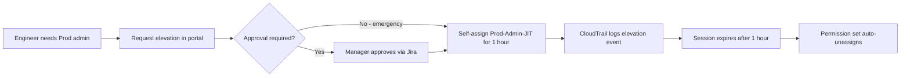

# Scenario 3: RBAC Design — Design

## Role Taxonomy

InnoGrid's RBAC model follows a three-layer hierarchy:

```
Job Function ───► Role ───► Permission Set
     │                  │               │
     ▼                  ▼               ▼
 What you do     Your job title    What you can do
 (department)    (specific role)   (technical rights)
```

### Layer 1: Job Functions

| Function | Department(s) | Identity Source |
|---|---|---|
| `platform-engineering` | Platform Engineering | IAM Identity Centre |
| `app-dev` | Application Development | IAM Identity Centre |
| `qa` | QA & Testing | IAM Identity Centre |
| `iam` | IAM Team | IAM Identity Centre |
| `soc` | SOC | IAM Identity Centre |
| `service-desk` | IT Support | IAM Identity Centre |
| `finance` | Finance | Entra ID → SCIM |
| `hr` | HR | Entra ID → SCIM |
| `legal` | Legal | Entra ID → SCIM |
| `marketing` | Sales & Marketing | Entra ID → SCIM |
| `operations` | Operations | Entra ID → SCIM |
| `executive` | C-Suite | Entra ID → SCIM |

### Layer 2: Roles

Each job function has standardized roles:

| Role | Function | Level | AWS Access |
|---|---|---|---|
| `engineer` | platform-engineering, app-dev, qa | IC2+ | Nonproduction read-write |
| `senior-engineer` | platform-engineering, app-dev | IC4+ | Nonproduction read-write + Security read-only |
| `lead` | platform-engineering, app-dev, qa, iam, soc | M1+ | Nonproduction read-write + Security read-write |
| `manager` | All | M2+ | Nonproduction read-write + Security read-write + Prod read-only |
| `admin` | iam | IC3+ | All accounts except Prod write (JIT only) |
| `analyst` | soc | IC2+ | Security read-write |
| `support` | service-desk | IC1+ | Security read-only |
| `reader` | finance, hr, legal, marketing, operations | All | Prod read-only (cost/billing data) |
| `exec-reader` | executive | Exec | All accounts read-only |

### Layer 3: Permission Sets

5 standardized permission sets cover all roles:

| Permission Set | Accounts | Policies | Session |
|---|---|---|---|
| `ReadOnly` | Security, Prod, Nonprod | `arn:aws:iam::aws:policy/ReadOnlyAccess` | 4h |
| `NonprodDev` | Nonprod | `ReadOnlyAccess` + custom inline: EC2 run/stop, S3 read/write (dev buckets), SSM start session | 8h |
| `SecurityOps` | Security | `ReadOnlyAccess` + `SecurityAudit` + `AWSSupportAccess` | 4h |
| `ProdRead` | Prod | `ReadOnlyAccess` (with exceptions for cost data) | 4h |
| `ProdAdmin_JIT` | Prod | `AdministratorAccess` (self-managed, approval required) | 1h |

## Naming Convention

```
Group:      <function>-<role>
Example:    platform-engineering-engineer
            iam-admin
            finance-reader

Permission Set: <scope>-<level>
Example:        Nonprod-Dev
                Prod-ReadOnly
                Prod-Admin-JIT
```

## Group-to-Permission Set Mapping

| Group | Permission Set | Account | Type |
|---|---|---|---|
| `platform-engineering-engineer` | `Nonprod-Dev` | Nonprod | Standing |
| `platform-engineering-engineer` | `Prod-ReadOnly` | Prod | Standing |
| `platform-engineering-senior` | `Nonprod-Dev` | Nonprod | Standing |
| `platform-engineering-senior` | `Prod-ReadOnly` | Prod | Standing |
| `platform-engineering-senior` | `Security-ReadOnly` | Security | Standing |
| `platform-engineering-lead` | `Nonprod-Dev` | Nonprod | Standing |
| `platform-engineering-lead` | `Security-ReadOnly` | Security | Standing |
| `platform-engineering-lead` | `Prod-ReadOnly` | Prod | Standing |
| `app-dev-engineer` | `Nonprod-Dev` | Nonprod | Standing |
| `app-dev-senior` | `Nonprod-Dev` | Nonprod | Standing |
| `app-dev-senior` | `Security-ReadOnly` | Security | Standing |
| `qa-engineer` | `Nonprod-Dev` | Nonprod | Standing |
| `iam-admin` | `Nonprod-Dev` | Nonprod | Standing |
| `iam-admin` | `Security-Ops` | Security | Standing |
| `iam-admin` | `Prod-ReadOnly` | Prod | Standing |
| `soc-analyst` | `Security-Ops` | Security | Standing |
| `soc-support` | `Security-ReadOnly` | Security | Standing |
| `service-desk-support` | `Security-ReadOnly` | Security | Standing |
| `finance-reader` | `Prod-ReadOnly` | Prod | Standing |
| `hr-reader` | `Prod-ReadOnly` | Prod | Standing |
| `legal-reader` | `Prod-ReadOnly` | Prod | Standing |
| `marketing-reader` | `Prod-ReadOnly` | Prod | Standing |
| `operations-reader` | `Prod-ReadOnly` | Prod | Standing |
| `executive-reader` | `Prod-ReadOnly` | Prod | Standing |
| `executive-reader` | `Nonprod-Dev` | Nonprod | Standing |
| `executive-reader` | `Security-ReadOnly` | Security | Standing |

## JIT Elevation Design

Production admin access uses a separate permission set (`Prod-Admin-JIT`) that is **not** assigned to any group by default. Users self-assign via the AWS IAM Identity Centre access portal or via a custom approval workflow:



### JIT Permission Set: `Prod-Admin-JIT`

```json
{
  "name": "Prod-Admin-JIT",
  "session_duration": "PT1H",
  "managed_policies": ["arn:aws:iam::aws:policy/AdministratorAccess"],
  "relay_state": "https://console.aws.amazon.com/cloudwatch",
  "tags": {
    "Purpose": "JITElevation",
    "AutoExpire": "true"
  }
}
```

## Separation of Duties Matrix

| Activity | Prod Deploy | Security Audit | IAM Admin | Billing Read |
|---|---|---|---|---|
| Platform Engineer | Needs JIT | ✓ | ✗ | ✓ |
| App Developer | Needs JIT | ✗ | ✗ | ✗ |
| QA Engineer | ✗ | ✗ | ✗ | ✗ |
| IAM Admin | ✗ | ✓ | ✓ | ✓ |
| SOC Analyst | ✗ | ✓ | ✗ | ✗ |
| Finance Reader | ✗ | ✗ | ✗ | ✓ |

## Migration Strategy

| Phase | Action | Duration |
|---|---|---|
| 1 | Create all new RBAC groups + permission sets alongside existing ones | Day 1 |
| 2 | Add users to new groups (dual membership during migration) | Day 2 |
| 3 | Verify access via new groups, test JIT elevation | Day 3 |
| 4 | Remove users from old groups | Day 4 |
| 5 | Archive/delete old orphaned groups | Day 5 |
| 6 | Update documentation and Terraform modules | Day 6 |

## Compliance Mapping

| Requirement | Control | How It's Met |
|---|---|---|
| Cyber Essentials Plus | Logical access | Standardised RBAC groups prevent over-privilege |
| Cyber Essentials Plus | Segregation of duties | Separation of duties matrix enforced via distinct permission sets |
| ISO 27001 A.9.1.2 | Access to networks | JIT elevation for production limits standing access |
| ISO 27001 A.9.2.3 | Privilege management | No standing admin — JIT with approval and auto-expiry |
