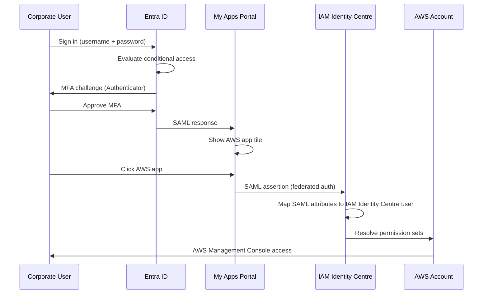
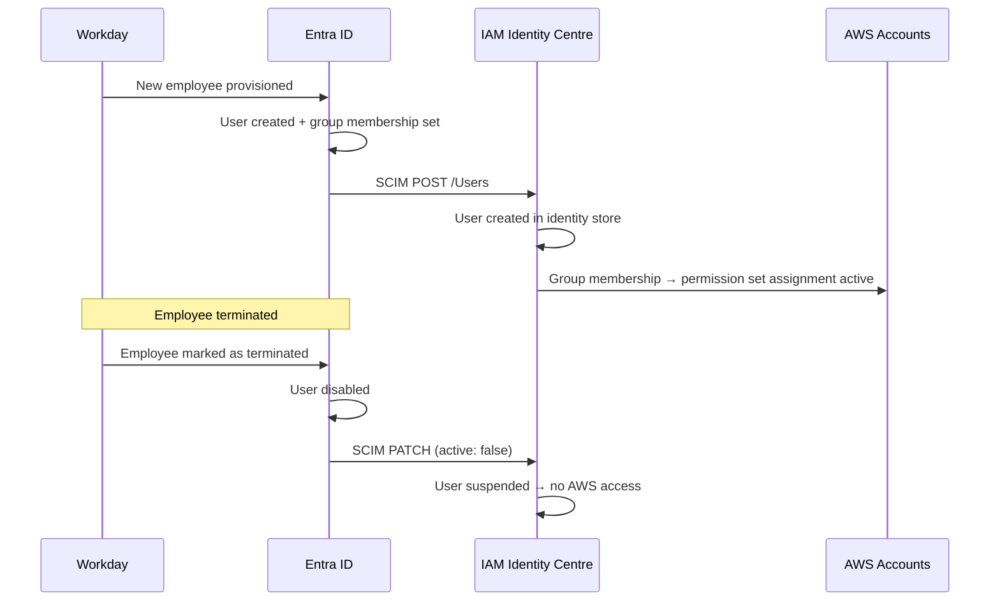

# Scenario 4: Federation / SSO — Design

## Architecture Overview

```
┌──────────────────────────────┐     ┌──────────────────────────────┐
│  Microsoft Entra ID          │     │  AWS IAM Identity Centre     │
│  (Corporate IdP)             │     │  (AWS SSO)                   │
│                              │     │                              │
│  Users:                       │     │  Users:                      │
│  - HR, Finance, Legal, etc.  │     │  - Entra ID (via SCIM)      │
│                              │     │  - Engineering (direct)      │
│  Auth: SAML 2.0 ─────────────┼────►│  - Engineering auth: direct  │
│  SCIM: /scim ────────────────┼────►│                              │
│                              │     │  Groups: SCIM-synced +       │
│  Conditional Access:         │     │  IAM Identity Centre-native  │
│  - MFA required              │     │                              │
│  - Device compliance for     │     │  Permission Sets → AWS      │
│    production                │     │  Accounts                    │
│  - Trusted locations         │     │                              │
└──────────────────────────────┘     └──────────────────────────────┘
```

## Identity Flow



## SCIM Provisioning Flow



## Attribute Mapping

| Entra ID Attribute | IAM Identity Centre Attribute | Notes |
|---|---|---|
| `userPrincipalName` | `userName` | Login identifier |
| `displayName` | `displayName` | Display name |
| `givenName` | `name.givenName` | First name |
| `surname` | `name.familyName` | Last name |
| `mail` | `emails[primary].value` | Email address |
| `employeeId` | `externalId` | HR reference |
| `department` | `userType` | Used for RBAC group mapping |
| `manager` | — | Not synced natively; tracked in HR system |

## Conditional Access Policies

| Policy | Target | Condition | Grant |
|---|---|---|---|
| Require MFA for AWS | All corporate users | Any cloud app = `AWS` | Require MFA |
| Block legacy auth | All users | Client apps = legacy auth | Block |
| Device compliance for prod | Finance, Legal, Ops | Cloud app = AWS, group = `Prod-ReadOnly` | Require compliant device |
| Trusted locations for admin | IAM admins | Risk = medium+ | Require trusted location + MFA |
| Session timeout | All users | Cloud app = AWS | Session timeout = 8 hours |

## Group Sync Design

Only corporate groups needed for RBAC are synced to IAM Identity Centre:

| Entra ID Group | IAM Identity Centre Group | SCIM Sync |
|---|---|---|
| `HR-Team` | `hr-reader` | Enabled |
| `Finance-Team` | `finance-reader` | Enabled |
| `Legal-Team` | `legal-reader` | Enabled |
| `Marketing-Team` | `marketing-reader` | Enabled |
| `Operations-Team` | `operations-reader` | Enabled |
| `Executive-Team` | `executive-reader` | Enabled |

Engineering groups (`platform-engineering-engineer`, `iam-admin`, etc.) remain **IAM Identity Centre-native** — not synced from Entra ID.

## Compliance Mapping

| Requirement | Control | How It's Met |
|---|---|---|
| Cyber Essentials Plus | Logical access | SSO with MFA for all AWS access |
| Cyber Essentials Plus | Authorisation | SCIM auto-deprovisions on termination |
| ISO 27001 A.9.2.1 | User registration | Entra ID + SCIM = single identity source |
| ISO 27001 A.9.4.2 | Secure log-on procedures | Conditional access: MFA + device compliance |
