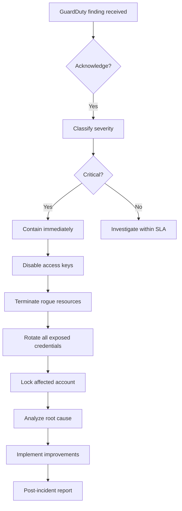

# Scenario 6: IAM Incident Response — Design

## Incident Response Architecture

```
Detection
  ┌──────────────┐  ┌──────────────┐  ┌──────────────┐
  │  GuardDuty   │  │  CloudTrail  │  │  Security    │
  │  (findings)  │  │  (real-time) │  │  Hub         │
  └──────┬───────┘  └──────┬───────┘  └──────┬───────┘
         │                 │                 │
         └─────────────────┼─────────────────┘
                           │
                           ▼
                  ┌──────────────────┐
                  │  EventBridge     │
                  │  Rule            │
                  └────────┬─────────┘
                           │
                           ▼
                  ┌──────────────────┐
                  │  SOC PagerDuty   │
                  │  (Tanya Brooks)  │
                  └────────┬─────────┘
                           │
                           ▼
Containment
                  ┌──────────────────┐
                  │  IR Runbook      │
                  │  (automated +    │
                  │   manual steps)  │
                  └────────┬─────────┘
                           │
          ┌────────────────┼────────────────┐
          │                │                │
          ▼                ▼                ▼
  ┌────────────┐   ┌────────────┐   ┌────────────┐
  │ Disable    │   │ Terminate  │   │ Rotate     │
  │ IAM keys   │   │ EC2        │   │ all        │
  │ & users    │   │ instance   │   │ exposed    │
  │            │   │            │   │ secrets    │
  └────────────┘   └────────────┘   └────────────┘
```

## Incident Severity Levels

| Level | Description | Response Time | Examples |
|---|---|---|---|
| **SEV-1** | Active data exfiltration, privilege escalation, or cryptomining | 15 min | This scenario |
| **SEV-2** | Suspicious behaviour, policy violations, single-user compromise | 1 hour | GuardDuty medium findings |
| **SEV-3** | Minor policy violations, configuration drift | 24 hours | Untagged resources, stale keys |

## Response Playbook: IAM Credential Compromise



## Detection Controls

| Detection | Source | Trigger |
|---|---|---|
| Instance launched in unauthorised region | CloudTrail + EventBridge | `ec2:RunInstances` in region not in allowed list |
| IAM user creates access key for another user | CloudTrail | `iam:CreateAccessKey` with different user |
| API call from Tor exit node | GuardDuty | `UnauthorizedAccess:IAMUser/InstanceCredentialExfiltration.OutsideAWS` |
| S3 data transfer to external IP | VPC Flow Logs + GuardDuty | Unexpected large egress |
| Crypto instance type launched | CloudTrail + Config | `p3.*`, `p4.*`, `g4dn.*` instance types |

## Containment Options

| Option | Scope | Time | Impact |
|---|---|---|---|
| **Immediate key rotation** | Compromised user | < 1 min | Application disruption |
| **Attach SCP to deny all** | Account-level | < 5 min | Affects all users |
| **Detach IAM policies** | Specific user | < 2 min | Affects that user only |
| **Terminate EC2 instance** | Specific resource | < 1 min | Loses forensic data |
| **Isolate EC2 (security group)** | Specific resource | < 1 min | Preserves instance for forensics |
| **Disable IAM user** | Specific user | < 1 min | Prevents any API calls |

## Forensic Data Sources

| Source | Data | Retention |
|---|---|---|
| CloudTrail management events | All API calls | 90 days in S3 + 1 year in archive |
| CloudTrail data events | S3 object-level operations | 90 days |
| VPC Flow Logs | Network traffic metadata | 30 days |
| GuardDuty findings | Detection details | 90 days |
| Security Hub | Aggregated findings | 90 days |
| EC2 instance volume | Disk forensics | N/A (need snapshot before terminate) |

## Compliance Mapping

| Requirement | Control | How It's Met |
|---|---|---|
| Cyber Essentials Plus | Incident detection | GuardDuty + Security Hub + CloudTrail |
| Cyber Essentials Plus | Incident response | Documented playbook with 15-min SLA |
| NCSC CAF | Incident communication | PagerDuty → SOC → CISO escalation |
| ISO 27001 A.16.1.5 | Response to incidents | SEV-1: 15-min containment, SEV-2: 1-hour |
| ISO 27001 A.16.1.7 | Collection of evidence | CloudTrail logs secured in immutable S3 bucket |
